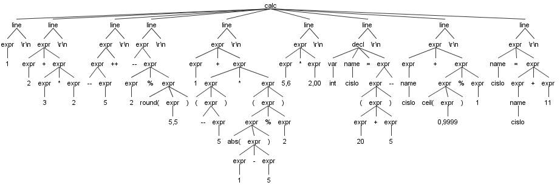

# U1 Vlastní jazyk

## Datové typy
* int: 32bit
* float: 32bit

## Operace a operátory
* sčítání, odčítání: +, -
* násobení, dělení: *, /
* modulo: %
* závorky: (, )
* inkrement, dekrement: ++, --

## Priorita operátorů
1. ++, --
3. *, /, %
4. +, -

## Příklad deklarace a inicializace proměnných
int number = 8;  
float ones = 1,111;

## Funkce
* absolutní hodnota: abs(a)
* zaokrouhlování: ceil(a), floor(a), round(a)

## Správný výraz
(a * b) / abs(a++) + ceil(round(a--) % floor(b))  

# U2 Gramatika
* [soubor .g4](https://github.com/kaleckyj/prk2021/blob/main/Calc.g4)  
```
grammar Calc;

calc:	line*;
line:	expr NEWLINE                    # expression
    |	decl NEWLINE			# declare
    |   NEWLINE                         # blank
    ;

var:	'int' | 'float';
decl:	var name '=' expr;
name:	ID;

expr:   expr op=('*'|'/'|'%') expr      # mulDivMod
    |   expr op=('+'|'-') expr          # addSub
    |   op=('++'|'--') expr             # incPre
    |   expr op=('++'|'--')             # incPost
    |	'abs(' expr ')'                 # abs
    |   'ceil(' expr ')'                # ceil
    |   'floor(' expr ')'               # floor
    |   'round(' expr ')'               # round
    |   '('expr')'                      # parenth
    |   FLOAT                           # float
    |   INT                             # int
    |	name '=' expr			# assignment
    |	name				# variable
    ;

MUL:    '*';
DIV:    '/';
MOD:    '%';
ADD:    '+';
SUB:    '-';
INC:    '++';
DEC:    '--';

WHITESPACE: (' ' | '\t') -> skip;
ID: [a-zA-Z]+;
INT: NUMBER+ ;
FLOAT: NUMBER+ (COMMA NUMBER+)? ;
NEWLINE: [\r\n]+ ;

fragment NUMBER: ('0' .. '9') ;
fragment COMMA: (',') ;

```
## Sestavení lexeru a parseru: 
* v cmd, gramatika v souboru Calc.g4  
``` 
   antlr4 Calc.g4
   javac *.java
```
* zobrazení stromu (zadat testovaci příklad(y, oddělit řádky), ukončit ctrl+Z [windows]): 
``` 
   grun Calc calc -gui
```
   
## Spuštění kalkulačky
* java MainCalc test_ok.calc spustí kalkulačku nad test_ok.calc souborem  
   
## Testovací soubor test_ok  
* [OK test](https://github.com/kaleckyj/prk2021/blob/main/test_ok.calc)  
```
1
2 + 3 * 2
--5++
--2 % round(5,5)
1 + (--5) * (abs(1-5)%2)
int cislo = (20+5)--
```
## Testovací soubor test_fail  
* [FAIL test](https://github.com/kaleckyj/prk2021/blob/main/test_fail.calc)  
```
-1
2 ++ 3
abs5
5 4 3 2 1
ceil()
int cislo = a
```
